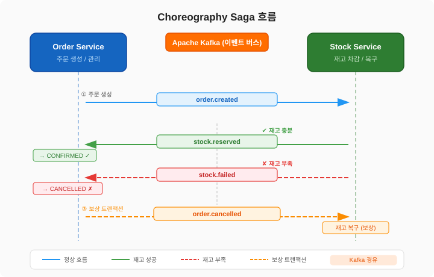

# Event-Flow-Market

대규모 트래픽 대응을 위한 이벤트 기반 분산 커머스 시스템.

서비스 간 결합도를 낮추고 확장성을 극대화한 MSA 아키텍처로, Choreography Saga 패턴을 통해 분산 트랜잭션의 데이터 일관성을 보장합니다.

## 아키텍처

```
Client
  │
  ▼
[Gateway]  ← JWT 검증, 라우팅
  │
  ├──► [Member Service]   ← 회원 가입/로그인, JWT 발급 (Redis 리프레시 토큰)
  ├──► [Order Service]    ← 주문 생성/취소, Transactional Outbox 패턴
  └──► [Stock Service]    ← 재고 차감/복구, Redisson 분산락

[Kafka] ← Choreography Saga 이벤트 버스
  order.created  →  stock-service
  stock.reserved →  order-service  (CONFIRMED)
  stock.failed   →  order-service  (CANCELLED → order.cancelled)
  order.cancelled → stock-service  (재고 복구 보상 트랜잭션)
```

## 기술 스택

| 영역 | 기술 |
|------|------|
| 언어 | Kotlin |
| 프레임워크 | Spring Boot 4.0.5, Spring Cloud 2025.1.1 |
| 빌드 | Gradle 8.x (Kotlin DSL), Java 24 |
| 메시징 | Apache Kafka (Choreography Saga, Outbox 패턴) |
| 캐싱/분산락 | Redis (리프레시 토큰, Redisson 분산락) |
| 인프라 | Docker, Kubernetes (kind) |
| 오토스케일 | KEDA (Kafka Consumer Lag 기반) |
| 관측성 | Prometheus, Grafana, Zipkin, Loki, Promtail |
| 부하 테스트 | k6 |

## 핵심 설계 패턴

### Choreography Saga

주문 → 재고 차감 → 주문 확정 흐름에서 실패 시 보상 트랜잭션으로 롤백합니다.



Orchestration 대신 Choreography를 선택한 배경 → [Orchestration 대신 Choreography를 선택한 배경](../../wiki/)

### Transactional Outbox 패턴

주문 저장과 Kafka 이벤트 발행의 원자성 보장:
- 주문 저장 + `OutboxEvent` 삽입을 동일 트랜잭션으로 처리
- 별도 폴러(`@Scheduled`, 1s interval)가 Outbox 테이블을 읽어 Kafka 발행
- 발행 실패 시 `status=FAILED`로 기록 후 재시도 (`retry_count` 추적)
- `retry_count >= MAX_RETRY(5)` 초과 시 `DEAD_LETTER`로 전환하여 무한 재시도 방지

### Redisson 분산락

선착순 재고 차감 시 Race Condition 방지:
- `RLock`으로 productId 기준 락 획득 후 차감
- Kafka Consumer 멱등성: `ProcessedEvent` 테이블로 이벤트 중복 처리 방지
- 보상 트랜잭션 정확성: `ReservedOrder` 테이블로 실제 예약된 주문만 재고 복구

## 빠른 시작

### 사전 요구사항

- Docker Desktop (메모리 12GB 권장)
- kind
- kubectl
- k6 (부하 테스트 시)
- jq (부하 테스트 사전 준비 시)

### 로컬 kind 클러스터 실행

```bash
# 1. 클러스터 생성
make cluster-up

# 2. 시크릿 파일 준비
cp k8s/secret.yaml.example k8s/secret.yaml
# secret.yaml에서 JWT_SECRET 등 값 설정

# 3. 이미지 빌드 및 클러스터 로드
make build
make load

# 4. K8s 매니페스트 전체 배포
make deploy

# 5. port-forward 시작
make pf-up
```

| 서비스 | 주소 |
|--------|------|
| Gateway | http://localhost:8080 |
| Grafana | http://localhost:3000 (admin/admin) |
| Prometheus | http://localhost:9090 |
| Zipkin | http://localhost:9411 |

### docker compose (로컬 개발)

```bash
docker compose up -d
```

## Makefile 명령

```bash
make pf-up          # 전체 port-forward 시작
make pf-down        # port-forward 종료
make pf-status      # port-forward 상태 확인
make pf-gateway     # Gateway만 port-forward

make build          # Docker 이미지 빌드
make load           # kind 클러스터에 이미지 로드
make deploy         # K8s 매니페스트 전체 적용
make rollout        # 이미지 재빌드 + rolling restart

make db SVC=member  # member_db psql 접속 (order, stock 가능)
make status         # 전체 Pod/Service 상태 확인
make logs SVC=gateway  # 서비스 로그 스트리밍
```

## 주요 API

### Member Service

| Method | Path | 설명 | 인증 |
|--------|------|------|------|
| POST | `/api/members/signup` | 회원 가입 | N |
| POST | `/api/members/login` | 로그인 (JWT 발급) | N |
| POST | `/api/members/token/refresh` | 액세스 토큰 재발급 | N |
| GET | `/api/members/me` | 내 프로필 조회 | Y |

### Order Service

| Method | Path | 설명 | 인증 |
|--------|------|------|------|
| POST | `/api/orders` | 주문 생성 | Y |
| GET | `/api/orders` | 내 주문 목록 | Y |
| GET | `/api/orders/{orderId}` | 주문 조회 | Y |
| DELETE | `/api/orders/{orderId}` | 주문 취소 | Y |

### Stock Service

| Method | Path | 설명 | 인증 |
|--------|------|------|------|
| POST | `/api/stocks/{productId}` | 재고 등록 | Y |
| GET | `/api/stocks/{productId}` | 재고 조회 | Y |

## 관측성

### Grafana 대시보드

| 대시보드 | 설명 |
|----------|------|
| JVM (Micrometer) | Heap, GC, 스레드 수 |
| Kafka Exporter Overview | Consumer Lag, 토픽 처리량 |
| Spring Boot Observability | HTTP 요청수, 응답시간 p50/p95/p99, 에러율, Loki 로그 연동 |

### 분산 추적 (Zipkin)

Micrometer Tracing + Brave 기반 B3 Propagation으로 Gateway → 서비스 간 traceId 전파 및 Kafka Saga 흐름 추적이 가능합니다.

### 로그 수집 (Loki + Promtail)

- Spring Boot Structured Logging(`logstash` 포맷)으로 JSON 로그 출력
- Promtail DaemonSet이 pod 로그를 수집 → Loki 전송
- Grafana Explore에서 `{namespace="event-flow-market"}` 쿼리로 조회
- `traceId` 필드로 Loki 로그 ↔ Zipkin 트레이스 연결 가능

## 부하 테스트

선착순 재고 차감 시나리오 — 동시 100명이 주문 요청:

**1. 사전 준비: 재고 등록**

```bash
# 회원 가입
curl -X POST http://localhost:8080/api/members/signup \
  -H 'Content-Type: application/json' \
  -d '{"email":"your@email.com","password":"yourpassword"}'

# 로그인 및 토큰 획득
TOKEN=$(curl -s -X POST http://localhost:8080/api/members/login \
  -H 'Content-Type: application/json' \
  -d '{"email":"your@email.com","password":"yourpassword"}' \
  | jq -r '.data.accessToken')

# productId=1 상품에 재고 500개 등록
curl -X POST http://localhost:8080/api/stocks/1 \
  -H 'Content-Type: application/json' \
  -H "Authorization: Bearer $TOKEN" \
  -d '{"quantity": 500}'
```

**2. 부하 테스트 실행**

```bash
k6 run k6/stock-reservation.js \
  -e BASE_URL=http://localhost:8080 \
  -e PRODUCT_ID=1 \
  -e TEST_EMAIL=your@email.com \
  -e TEST_PASSWORD=yourpassword
```

**kind 환경 측정 결과 (재고 500개, VU 100, 총 주문 1486건):**

| 지표 | 결과 |
|------|------|
| HTTP 에러율 | 0% |
| PENDING 잔류 | 0건 |

> kind + port-forward 환경의 오버헤드로 인한 지연 포함. 실제 클라우드 환경에서는 응답시간이 크게 개선됩니다.

## 모듈 구조

```
Event-Flow-Market/
├── common/          # 공유 라이브러리 (이벤트 DTO, 공통 예외, ApiResponse)
├── gateway/         # API Gateway (JWT 검증, 라우팅)
├── member-service/  # 회원 인증/인가 서비스
├── order-service/   # 주문 서비스 (Outbox 패턴)
├── stock-service/   # 재고 서비스 (Redisson 분산락)
├── k8s/             # Kubernetes 매니페스트
├── k6/              # 부하 테스트 스크립트
├── Makefile         # 운영 명령 모음
└── docker-compose.yml
```
